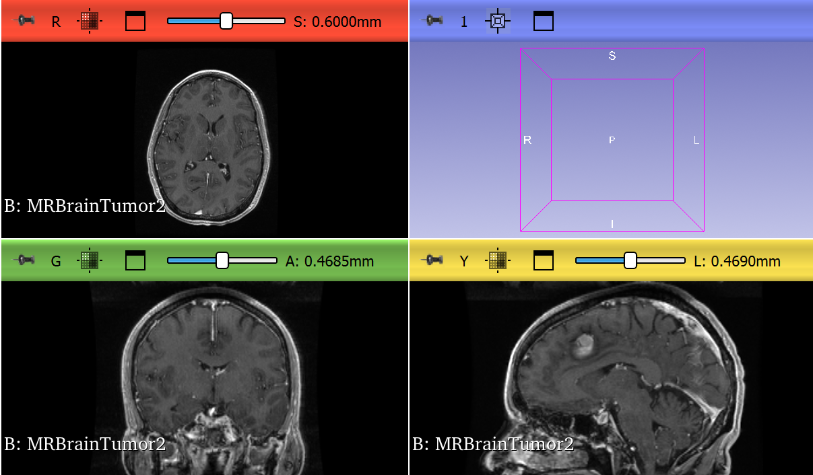
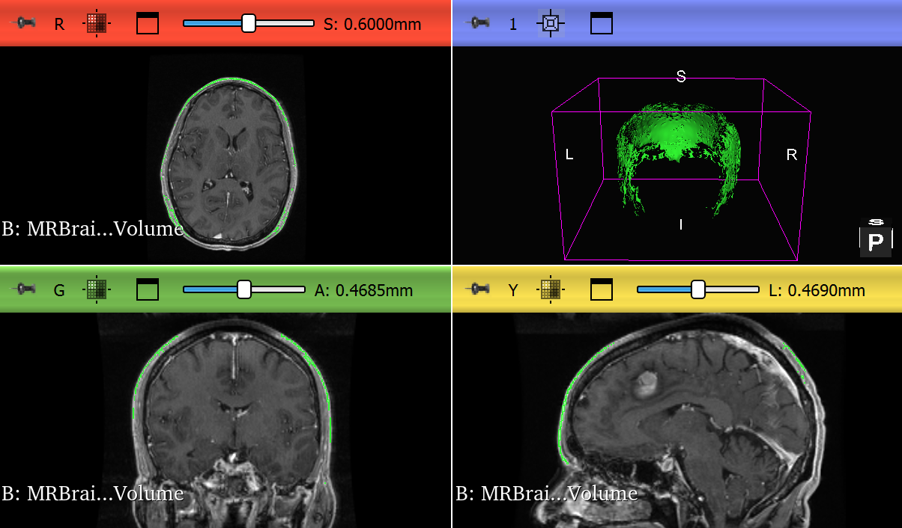
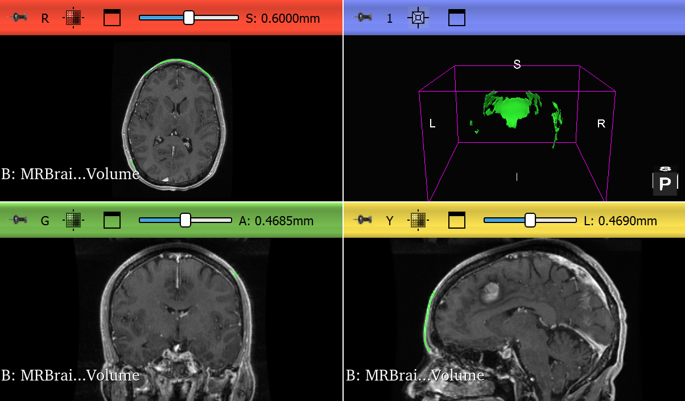
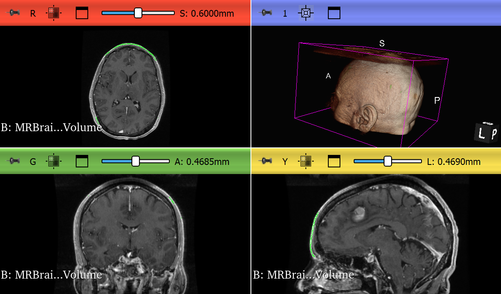

# Brain MRI Region Annotation and 3D Visualization Using 3D Slicer

## Project Overview

This project demonstrates a medical imaging workflow using 3D Slicer. I used the MRBrainTumor2 sample dataset to review a brain MRI, annotate a visible region of interest, clean the segmentation, generate a 3D model, and export files suitable for portfolio presentation.

The project shows practical skills in medical image annotation and AI training data preparation. It includes original MRI visualization, region selection, segmentation cleanup, final 3D visualization, model exports, and workflow documentation.

## Dataset

- Dataset: MRBrainTumor2 sample data
- Source: Built-in 3D Slicer sample dataset
- Data type: Brain MRI volume
- Private patient data used: No

## Tools Used

- 3D Slicer
- MRI slice review
- Region annotation
- Segmentation cleanup
- 3D visualization
- Model export

## Workflow

1. Loaded the MRBrainTumor2 sample dataset in 3D Slicer.
2. Reviewed the MRI scan in axial, sagittal, coronal, and 3D views.
3. Captured the original MRI before annotation.
4. Created a region annotation based on a visible area of interest.
5. Reviewed the annotation across multiple views.
6. Cleaned the segmentation to reduce small artifacts.
7. Applied smoothing to improve the final region surface.
8. Generated a 3D model from the cleaned segmentation.
9. Exported the model in STL, OBJ, and PLY formats.
10. Documented the process with screenshots and workflow notes.

## Screenshots

### 1. Original Brain MRI Before Annotation

### 2. Region Annotation Selection

### 3. Cleaned MRI Segmentation

### 4. Final 3D Region Model

## Exported Files

models/
- BrainMRI_Final_Region_Model.stl
- BrainMRI_Final_Region_Model.obj
- BrainMRI_Final_Region_Model.ply

segmentations/
- BrainMRI_Cleaned_Region_Segmentation.seg.nrrd

scene/
- BrainMRI_Region_Annotation_Project.mrml

## AI Training Relevance

This project connects to AI training because medical imaging models often need labeled data for supervised learning and validation. A segmentation mask can act as a reference label for training, testing, or evaluating model outputs. This workflow shows how a human annotator can create, review, clean, and export structured medical image annotations.

## What This Project Shows

- I can work with MRI medical imaging data in 3D Slicer.
- I can identify and annotate a visible region of interest.
- I can review annotation results in multiple anatomical planes.
- I can clean segmentation artifacts.
- I can generate a 3D model from MRI annotation data.
- I can export model files in common 3D formats.
- I can document a technical workflow clearly.
